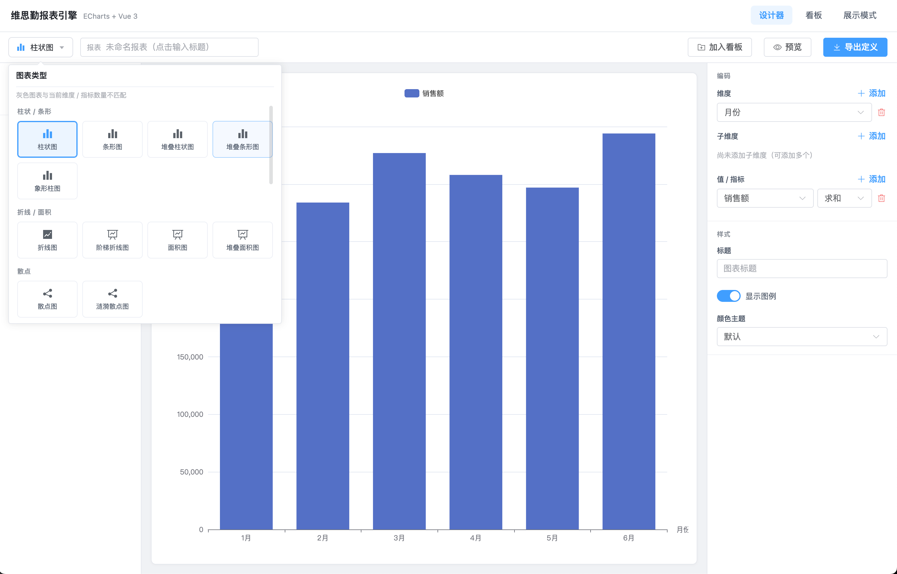
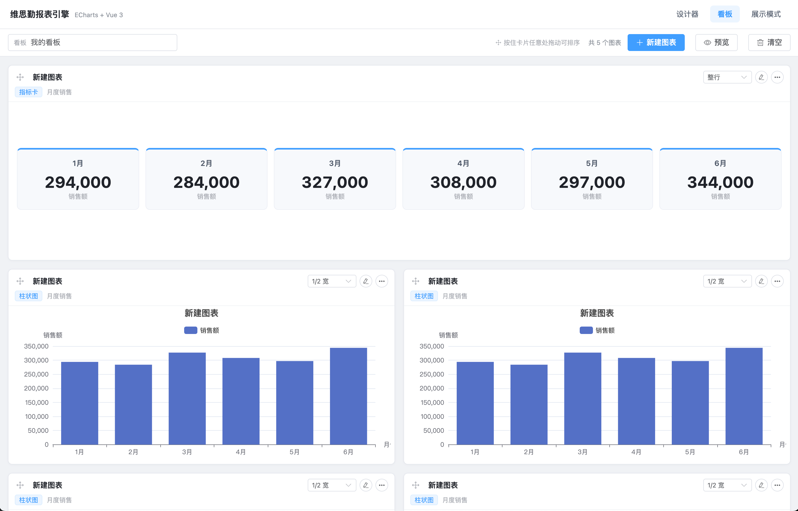

# 维思勤报表引擎（ECharts + Vue 3）

一个**纯前端**的自研报表引擎页面：用 JSON 表示数据集并定义其元数据，通过设计器把**维度**与**指标（度量）**绑定到图表编码通道，实时渲染 ECharts 图表；支持 **24 种图表类型**、多图表**看板布局**，并以只读的**展示模式**对外呈现。

计算与渲染的边界已经通过一层**报表查询接口契约**解耦：当前由前端内存中的 mock 后端完成分组聚合，接入真实后端时只需替换一个函数。

## 界面预览

### 报表设计器 `/design`

左侧字段面板（维度 / 指标）+ 中间实时画布 + 右侧编码与样式面板；顶部可按分类选择图表类型，不匹配当前维度/指标数量的图表会置灰。



### 看板 `/dashboard`

设计好的图表可一键「加入看板」，在看板中按 12 栅格布局（1/3、1/2、2/3、整行）排列，支持拖拽排序、重命名、复制、删除。



## 核心特性

- **元数据驱动**：数据集声明字段的 `dataType` / `role`（维度或指标）/ 可用聚合方式，设计器据此约束可选绑定。
- **24 种图表类型**：柱状/条形、折线/面积、散点、饼/占比、分布/关系、金融/统计、层级、指标卡、表格，共 9 大分类。
- **编码通道**：`dimensions`（有序复合分组维度）、`colors`（图例/颜色拆分维度，即子维度）、`values`（多指标 + 各自聚合方式）。
- **图表类型合法性校验**：每种图表声明维度/指标数量区间（如 K 线图必须 4 个指标、热力图必须 2 个维度），越界时后端返回 `INVALID_BINDING`，前端图表选择器同步置灰。
- **计算/渲染分层**：后端（mock）产出 `chart` / `metric` / `table` 三选一的数据载荷，前端只负责组装 ECharts option、指标卡或表格。
- **查询防抖与竞态安全**：仅「参与计算」的字段变化才触发请求（180ms 防抖），样式改动在前端即时重渲染；过期响应被丢弃。
- **看板**：多图表 12 栅格布局、拖拽排序、编辑回写、只读预览页。
- **持久化**：当前报表定义与看板内容写入 `localStorage`，刷新不丢；报表定义可导出为 JSON 文件。
- **单元测试**：Vitest 覆盖聚合计算、option 构建、渲染管线、接口客户端与看板 store。

## 技术栈

| 类别 | 选型 |
|---|---|
| 框架 | Vue 3（`<script setup>` + Composition API）+ TypeScript |
| 构建 | Vite 5 |
| 图表 | ECharts 5 |
| 状态管理 | Pinia（设计态 store、看板 store） |
| UI 组件 | Element Plus + `@element-plus/icons-vue` |
| 路由 | Vue Router（`/design`、`/dashboard`、`/dashboard/preview`、`/preview`） |
| 测试 | Vitest + `@vue/test-utils` + jsdom |

## 快速开始

```bash
npm install
npm run dev        # 启动开发服务器
```

其它命令：

```bash
npm run build      # 类型检查 + 生产构建
npm run typecheck  # 仅类型检查（vue-tsc）
npm run test       # 运行单元测试（vitest run）
npm run test:watch # 监听模式跑测试
npm run preview    # 预览生产构建
```

## 页面与路由

| 路由 | 页面 | 说明 |
|---|---|---|
| `/` | — | 重定向到 `/design` |
| `/design` | `DesignerView.vue` | 报表设计器：图表类型 / 数据集 / 字段绑定 / 样式 + 实时画布 |
| `/dashboard` | `DashboardView.vue` | 看板编辑：栅格布局、拖拽排序、重命名、复制、删除 |
| `/dashboard/preview` | `DashboardPreviewView.vue` | 看板只读展示 |
| `/preview` | `PreviewView.vue` | 单报表只读展示模式 |

## 架构与数据流

```
数据集 JSON（元数据 + 行数据）
        │
        ▼
设计器绑定 → ReportDefinition（可导出/持久化的报表定义 JSON）
        │
        ▼  toQueryRequest()
ReportQueryRequest ──▶ 查询接口（当前为 mock 后端）
                          ├─ 校验维度/指标数量约束
                          ├─ 内存分组聚合 sum/avg/count/min/max
                          └─ 产出 ReportData：chart | metric | table
        │
        ▼  dataToRenderResult() + 前端本地样式项
RenderResult ──▶ ECharts option / 指标卡 / 表格 → 画布、预览页、看板卡片
```

- **后端职责（算数据）**：分组、聚合、按图表类型组织数据结构，返回渲染就绪的 `view`。
- **前端职责（只管渲染）**：把 `view` + 样式（标题 / 图例 / 颜色主题）映射为 ECharts option，样式变化无需重新请求。
- 设计器与预览/看板共用同一条管线（`useReportQuery` → `queryReport`），保证所见即所得。

## 目录结构

```
src/
├── types/index.ts              # 数据模型：FieldMeta / Dataset / Encodings / ReportDefinition / Dashboard
├── mock/datasets/*.json        # 内置 mock 数据集（字段元数据 + 行数据）
├── data/registry.ts            # 数据集目录：枚举 / 按 id 获取
├── api/
│   ├── contract.ts             # 查询接口契约：请求 / 响应 / 错误码
│   ├── mockBackend.ts          # mock 后端：内存聚合 + 模拟网络延迟
│   └── reportClient.ts         # 接口客户端 + 定义↔请求/响应的转换
├── engine/
│   ├── aggregate.ts            # 内存分组聚合（sum/avg/count/min/max，支持多维与系列交叉）
│   ├── chartModel.ts           # 后端数据模型：dataset / ChartModel / MetricModel / TableModel
│   ├── chartTypes.ts           # 24 种图表的类型注册表（分类、图标、维度/指标数量约束）
│   ├── defaults.ts             # 默认报表定义工厂（看板「新建图表」的初始状态）
│   ├── optionBuilder.ts        # 数据模型 + 样式 → ECharts option
│   └── renderReport.ts         # 渲染管线与 RenderResult 定义
├── composables/useReportQuery.ts  # 查询防抖、竞态处理、样式即时重渲染
├── stores/
│   ├── designer.ts             # 设计态 store，派生报表定义与渲染结果
│   └── dashboard.ts            # 看板 store：组件增删改、跨度、排序、持久化
├── components/
│   ├── ChartCanvas.vue         # ECharts 实例封装（生命周期 + 自适应 resize）
│   ├── ChartTypePicker.vue     # 分组图表类型选择器（不匹配时置灰）
│   ├── ReportChart.vue         # 按渲染结果分发到图表 / 指标卡 / 表格
│   ├── MetricCardChart.vue     # 指标卡
│   ├── TableChart.vue          # 表格（含维度合并）
│   └── DashboardWidgetCard.vue # 看板图表卡片
└── views/
    ├── DesignerView.vue        # 设计器
    ├── DashboardView.vue       # 看板编辑
    ├── DashboardPreviewView.vue # 看板只读预览
    └── PreviewView.vue         # 单报表展示模式
```

## 数据模型约定

每个数据集是一份 JSON，包含 `id`、`name`、`fields`（字段元数据）与 `records`（行数据）。字段元数据关键字段：

| 字段 | 说明 |
|---|---|
| `name` | 字段标识，对应 record 中的键 |
| `label` | 展示名 |
| `dataType` | `string` / `number` / `date` / `boolean` |
| `role` | `dimension`（维度）或 `measure`（指标） |
| `aggregations` | 指标可用聚合方式（measure 必填） |
| `defaultAggregation` | 指标默认聚合方式（measure 必填） |

编码通道（`Encodings`）：

- `dimensions`：有序维度列表，多个维度构成复合类别分组；层级图中作为层级，热力图中前两个作为 X / Y 轴。
- `colors`：可选的图例/颜色拆分维度（子维度，支持多个），按取值复合拆分系列、系列名以 ` / ` 连接；不计入类别复合分组，但在维度数量校验中与 `dimensions` 合计。
- `values`：指标列表，每项含字段名与聚合方式。

> 交互规则：除表格外，图表在存在子维度时仅保留一个指标（系列通道已被拆分维度占用）；表格的子维度作维度列、多指标作指标列，两者可并存。

绑定结果序列化为**报表定义 JSON（`ReportDefinition`）**，展示模式与看板卡片据此复现图表。

## 查询接口契约

建议形态：`POST /api/report/query`，`Content-Type: application/json`。

请求（`ReportQueryRequest`）：

```json
{
  "datasetId": "monthly-sales",
  "chartType": "bar",
  "dimensions": ["month"],
  "colors": ["region"],
  "measures": [{ "field": "revenue", "aggregation": "sum" }],
  "options": { "title": "区域销售", "showLegend": true, "theme": "default" }
}
```

响应（`ReportQueryResponse`）：

```json
{
  "success": true,
  "took": 12,
  "data": { "type": "chart", "dataset": { "columns": [], "dimensionCount": 1, "rows": [] }, "view": {} }
}
```

失败时 `success: false` 并带 `error.code` / `error.message`，错误码：

| 错误码 | 含义 |
|---|---|
| `DATASET_NOT_FOUND` | 数据集不存在 |
| `UNSUPPORTED_CHART` | 不支持的图表类型 |
| `INVALID_BINDING` | 维度 / 指标数量不满足该图表类型的约束 |
| `UNKNOWN_FIELD` | 绑定的字段在数据集中不存在 |
| `INTERNAL` | 服务端内部错误 |

**接入真实后端**：只需把 [reportClient.ts](src/api/reportClient.ts) 中的 `queryReport` 换成 `fetch` 调用（文件内已给出示例实现），composable 与组件无需改动。

## 支持的图表类型

维度/指标数量区间是后端校验与设计器置灰的依据（`dimensions` 与 `colors` 合计计入维度）。

| 分类 | 图表 | 类型标识 | 维度 | 指标 |
|---|---|---|---|---|
| 柱状 / 条形 | 柱状图、条形图、堆叠柱状图、堆叠条形图 | `bar` `bar-horizontal` `stacked-bar` `stacked-bar-horizontal` | 1–3 | 1–5 |
| 柱状 / 条形 | 象形柱图 | `pictorial-bar` | 1 | 1 |
| 折线 / 面积 | 折线图、阶梯折线图、面积图、堆叠面积图 | `line` `step-line` `area` `stacked-area` | 1–3 | 1–5 |
| 散点 | 散点图、涟漪散点图 | `scatter` `effect-scatter` | 0–2 | 1–3 |
| 饼 / 占比 | 饼图、环形图、玫瑰图、漏斗图 | `pie` `doughnut` `rose` `funnel` | 1 | 1 |
| 分布 / 关系 | 雷达图 | `radar` | 1 | 1–5 |
| 分布 / 关系 | 热力图 | `heatmap` | 2 | 1 |
| 金融 / 统计 | K 线图 | `candlestick` | 1 | 4（开/收/最低/最高） |
| 金融 / 统计 | 箱线图 | `boxplot` | 1 | 1 |
| 层级 | 矩形树图、旭日图 | `treemap` `sunburst` | 1–4 | 1 |
| 指标 | 指标卡 | `metric-card` | 0–1 | 1–3 |
| 指标 | 仪表盘 | `gauge` | 0 | 1 |
| 表格 | 表格 | `table` | 1–3 | 1–5 |

> `map` / `graph` / `sankey` / `parallel` / `themeRiver` 等需要地理、节点-连线等非「维度-指标」表格型数据的图表，不在本表格型报表引擎范围内。

## 调试技巧

在浏览器控制台执行，用于观察前后端之间的实际载荷：

```js
localStorage['report-engine:api-debug'] = '1'   // 打印每次查询的 request / response
localStorage['report-engine:current-definition'] // 当前报表定义
localStorage['report-engine:dashboard']          // 看板内容
```

## 内置示例数据集

| id | 名称 | 维度 | 指标 |
|---|---|---|---|
| `monthly-sales` | 月度销售 | 月份、区域、品类 | 销售额、订单数、利润 |
| `website-traffic` | 网站流量 | 日期、来源渠道、设备 | 访问量、独立访客、转化数 |

## 新增一个数据集

1. 在 `src/mock/datasets/` 下新增一个符合上述结构的 `*.json`。
2. 在 `src/data/registry.ts` 中 import 并加入 `datasets` 数组。

## 新增一种图表类型

1. 在 `src/types/index.ts` 的 `ChartType` 联合类型中补充标识。
2. 在 `src/engine/chartTypes.ts` 的 `CHART_TYPES` 中登记分类、图标与维度/指标数量约束。
3. 在 `src/engine/chartModel.ts` 的 `buildChartModel` 中补充该类型的数据组装分支（产出 `ChartModel` 所需结构），并在 `src/engine/optionBuilder.ts` 中补充前端 option 映射。
4. 若需要默认绑定或特殊校验，同步调整 `src/stores/designer.ts` 与 `src/engine/defaults.ts`。

